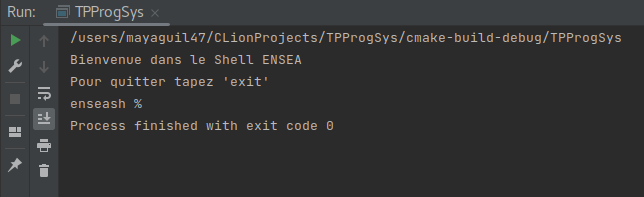
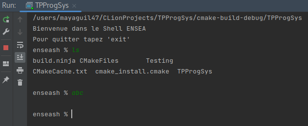
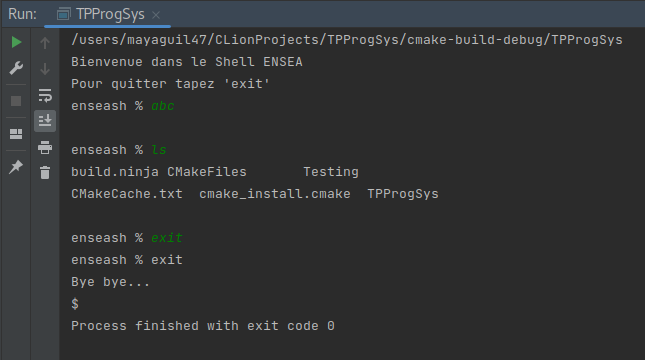
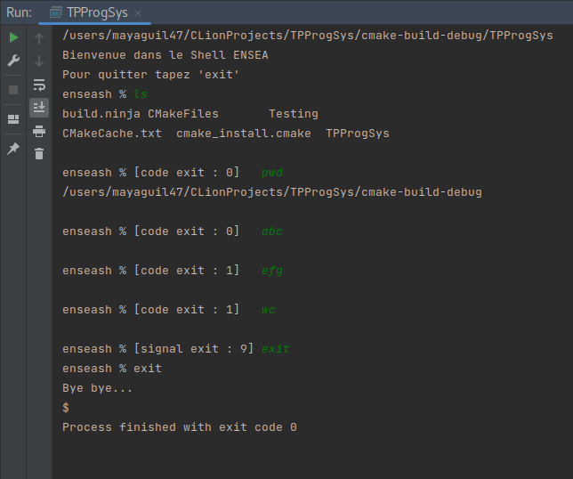
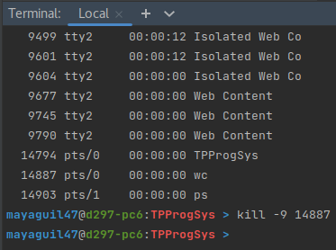
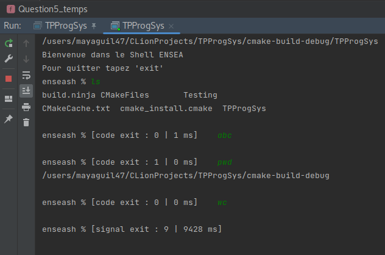
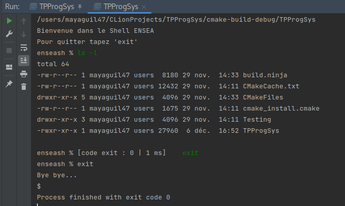
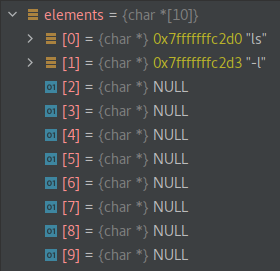

# TP de Synthèse – Ensea in the Shell

**Mayane GUILLON et Rania DOUIA**

## Question 1 : Affichage d’un message d’accueil, suivi d’un prompt simple
*Objectif: Créer un shell ensea et afficher un message d'acceuil : "$ ./enseashBienvenue dans le Shell ENSEA.Pour quitter, tapez 'exit'.enseash %"*

Pour cela, on utilise la fonction *write* dans la console(STDOUT_FILENO).

## Question 2 : Exécution de la commande saisie et retour au prompt (REPL : read–eval–print loop)
*Objectif: Créer un échange entre l'utilisateur (depuis le clavier) et notre programme*

Pour cela, on utilise les étapes suivants :

* **Lecture de la commande :** Capture une commande depuis l'entrée standard, transforme la saisie en une chaîne de caractères C.

* **Création d'un processus fils :** Utilise fork() pour créer un nouveau processus fils, qui est une réplique du processus parent.

* **Exécution de la commande dans le processus fils :** Dans le processus fils, la commande est exécutée à l'aide de la fonction execlp(), remplaçant ainsi le programme en cours d'exécution par la commande spécifiée.

* **Gestion du processus fils et écriture dans la sortie standard dans le processus parent :** Le processus parent attend la fin du processus fils avec wait(&status) et écrit une chaîne prédéfinie (ENSEA) dans la sortie standard.

Cette question repose sur la création d'un processus fils pour exécuter une commande envoyé dans la console. Une fois créer on attend que le processus fils se termine (et se détruise), puis une chaîne de caractères est écrit dans la sortie standard. Pour cela on utilise un fork() qui facilite l'exécution de la commande dans un contexte séparé du processus parent.

 

On voit que la commande "ls" est bien executé.

## Question 3 : Gestion de la sortie du shell avec la commande “exit” ou un <ctrl>+d
*Objectif: Créer une condition d'arrêt des commandes écritent dans la console*

Pour créer cette condition d'arrêt, on a conservé le code précédent en ajoutant un test qui va comparer à l'aide de la fonction strcmp(), la chaîne de caractère écrite dans la console avec l'instruction 'exit' ou ''. 

Si ces deux chaînes de caractère sont identiques, alors on écrit un message de sortie dans la console.

On voit bien que lorsque l'on écrit la commande 'exit' le programme s'arrête et renvoie un message d'au revoir. 

## Question 4 : Affichage du code de retour (ou du signal) de la commande précédente dans le prompt 
*Objectif: Créer une fonction qui renverra à l'utilisateur un message en indiquant si la commande est executée (code) ou interrompue (signal)*

Pour créer cette fonction, on a conservé le code précédent en ajoutant un test avec : 

* **WIFEXITED(status)** qui vérifie si le processus fils s'est terminé normalement, c'est-à-dire par un appel à exit() ou à la fonction return. Si cette condition est vraie, on renvoie un message écrit "code" avec l'utilisation de WEXITSTATUS(status). Celui-ci récupère le code de sortie du processus fils. *Dans notre cas:* 0 si il est executé sans erreur, 1 si la commande n'existe pas, ...

* **WIFSIGNALED(status)** qui vérifie si la terminaison (destruction) du processus fils est due à un signal. Ensuite, on renvoie un message écrit "code" avec l'utilisation de WTERMSIG(status). Celui-ci récupère le numéro du signal qui a provoqué la terminaison du processus. 

En résumé, cette partie du code fournit des informations détaillées sur la manière dont le processus fils s'est terminé, que ce soit par un code de sortie normal ou en réaction à un signal. Ces informations sont formatées et affichées dans la sortie standard pour informer l'utilisateur du résultat de l'exécution du processus fils.

Pour voir apparaître un retour de commande interrompu, lance une commande que l'on coupe dans le terminale.

## Question 5 : Mesure du temps d’exécution de la commande en utilisant l’appel clock_gettime 
*Objectif: Afficher le temps d'execution de la commande envoyée*

Pour créer cette fonction, on a conservé le code précédent. On a utilisé la fonction clock_gettime() pour enregistrer le temps de début et de fin dans des structures de type timespec nomées TimeStart et TimeStop.
Puis, on a calculé et renvoyé dans la console le temps écoulé entre le début (TimeStart) et la fin (TimeStop) en millisecondes.

On remarque que la commande *wc* a été interrompu comme précedemment et que le temps que l'on a mis a interrompre la commande est de l'ordre de 10s, soit bien plus longue qu'une execution classique réussite.

## Question 6 : Exécution d’une commande complexe (avec arguments) 
*Objectif:*

## Question 7 : Gestion des redirections vers stdin et stdout avec ‘<’ et ‘>’ 
*Objectif:*

## Réflexions personnelles
### Mayane GUILLON
### Rania DAOUIA 
