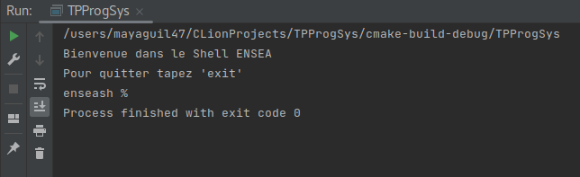
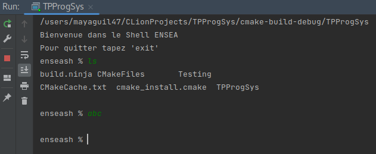

#TP de Synthèse – Ensea in the Shell

Question 1 : Affichage d’un message d’accueil, suivi d’un prompt simple

Nous avons créer un shell ensea, l'objectif était d'afficher le message d'acceuil. 

Question 2 : Exécution de la commande saisie et retour au prompt (REPL : read–eval–print loop)

Nous venons de créer un échange entre l'utilisateur (depuis le clavier) et notre programme.
 

compte rendu sera fini en fin de tp
